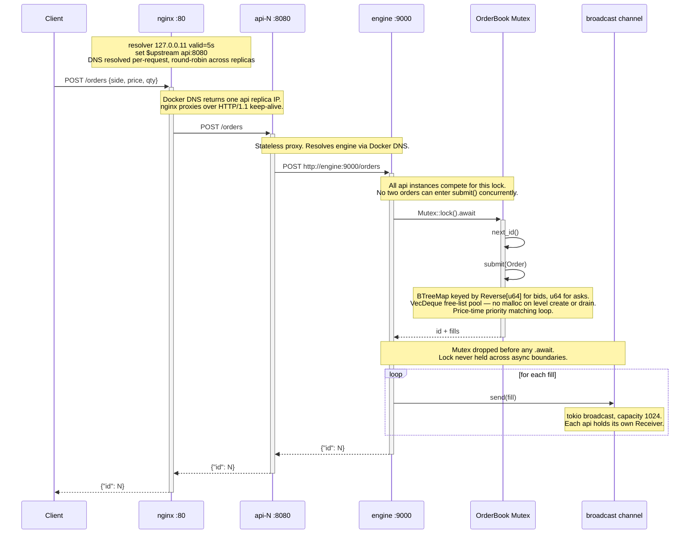
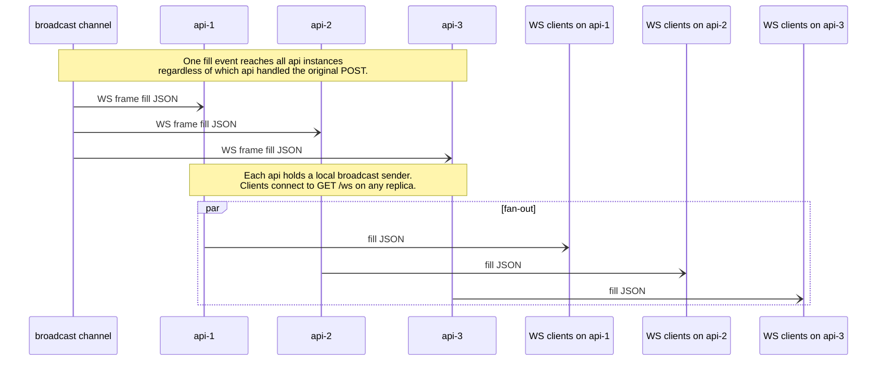

# Eterna

Streamed myself doing this assignment, and it split into two parts due to network disconnection  
1. https://youtube.com/live/3RTojiEOnoE  
2. https://youtube.com/live/tJmpMWQzNSk

Answers to the Questions asked in the assignment  
1. How does your system handle multiple API server instances without double-matching an order?  
A. using the two guardrails below
    - &mut self on submit() the compiler enforces exclusive access. You cannot call submit without holding the MutexGuard, so there is no way to construct a call without the lock.
    - Lock dropped before broadcast, the { let mut book = ...; (id, fills) } block ensures the MutexGuard goes out of scope before any .await. Following the skill rule: never hold a Mutex across an .await point, which would block the runtime thread

2. What data structure did you use for the order book and why?  
A. We used BTreeMap<K, VecDeque<Order>> - one per side (bids/asks) inside a HalfBook<K> struct. BTreeMap keeps price levels sorted and sparse (only active ticks exist as keys), giving O(log n) insert and best-price access where n is active levels not total orders. VecDeque per level gives O(1) push_back and pop_front for FIFO time-priority within a price. The bid side uses Reverse<u64> as the key type so keys().next() returns the highest bid — same call as asks, no branching. We added a cached best: Option<u64> for O(1) top-of-book reads in the match loop. We also added a free-list pool (Vec<VecDeque<Order>>) after flamegraph 03 showed dealloc + __bzero at 52% of runtime — drained VecDeques are cleared and recycled instead of dropped, eliminating the malloc/free cycle on every level exhaustion

3. What breaks first if this were under real production load?  
A. No Persistence in DB, Mutex is a global variable, so  every api instance serialises through a single lock, so throughput is hard-capped at single-threaded matching speed, and p99 latency spikes under concurrent load as waiters queue up

4. What would you build next if you had another 4 hours?  
A. A good mock ui, explore arena allocators, explore compressed sparse graph routines, deploy to AWS, and try to simulate prod, burn some more tokens

## Architecture

### Order submission



### Fill fan-out — WebSocket



## Run
To Run via Docker - `just docker-up`  
To Run locally - `just local-up`

## HTTP API

Docker: `http://localhost` (nginx on :80)  
Local: `http://localhost:8080` (api direct)

- POST /orders
```bash
# buy
curl -s -X POST http://localhost/orders \
  -H 'Content-Type: application/json' \
  -d '{"side":"buy","price":100,"qty":10}' | jq

# sell — matches the buy above
curl -s -X POST http://localhost/orders \
  -H 'Content-Type: application/json' \
  -d '{"side":"sell","price":100,"qty":5}' | jq
```

Response:
```json
{ "id": 1 }
```

- GET /orderbook
```bash
curl -s http://localhost/orderbook | jq
```

Response:
```json
{
  "bids": [{ "price": 100, "qty": 5 }],
  "asks": []
}
```

- GET /ws
```bash
# in a separate terminal before submitting orders
wscat -c ws://localhost/ws
# or
websocat ws://localhost/ws
```

- Fill event pushed on every match:
```json
{
  "maker_order_id": 1,
  "taker_order_id": 2,
  "price": 100,
  "qty": 5
}
```

## End-to-end test
Run `just test_api`

## Stress Test
Run `just stress`

## Flamegraphs

See [`flamegraphs/`](flamegraphs/) for profiling results and analysis.
