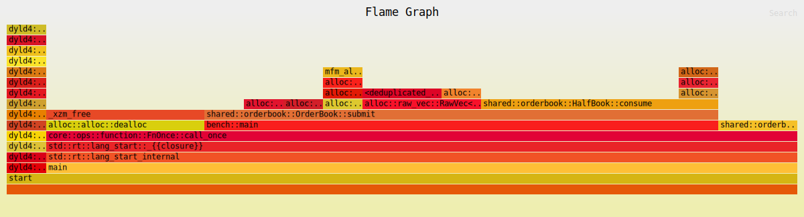
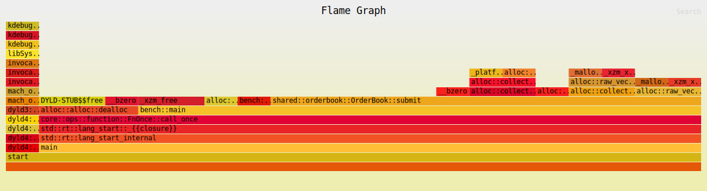

## 02.svg — HalfBook refactor (current)

### Hot path breakdown

| Rank | Function | Samples | % | Notes |
|------|----------|---------|---|-------|
| 1 | `shared::orderbook::OrderBook::submit` | 13 | 65.0% | Matching loop |
| 2 | `shared::orderbook::HalfBook::consume` | 6 | 30.0% | Level drain + best pointer update |
| 3 | `alloc::alloc::dealloc` | 4 | 20.0% | VecDeque buffer freed on level exhaustion |
| 4 | `alloc::raw_vec::RawVec::grow_one` | 3+1 | 15%+5% | VecDeque realloc on new level |
| 5 | `BTreeMap::entry::or_default` (insert) | 1 | 5.0% | New price level creation |
| 6 | `BTreeMap` remove internals | 1 | 5.0% | Pruned once per exhausted level |

### vs 01.svg (raw BTreeMap)

| Metric | 01 (raw BTreeMap) | 02 (HalfBook) | Change |
|--------|-------------------|---------------|--------|
| `OrderBook::submit` | 13/21 = 62% | 13/20 = 65% | +3% — matching owns more of runtime |
| `BTreeMap::remove` (direct) | 2+1 = 3 samples | 0 direct | Gone from top frame — moved inside `consume` |
| `HalfBook::consume` visible | — | 6 samples (30%) | New named frame; owns level drain + best update |
| `VecDeque::grow` | 2 samples | 1 sample | −50% — fewer new levels created per run |
| Total samples | 21 | 20 | ~same workload |

### Key findings

**`HalfBook::consume` is now a named, visible frame (30%)** — the best-pointer update and level removal that were previously scattered inline inside `submit` are now isolated. This is useful: profiling can now target `consume` independently.

**`BTreeMap::remove` dropped out of the top-level frame** — it's still called (inside `consume`) but no longer a direct child of `submit`. The O(log n) cost is still there but it's owned by a named function.

**Dealloc rose from 14% → 20%** — the bench workload heavily exhausts levels (aggressive sweeps). The `VecDeque` backing buffer free on level drain remains the dominant allocator cost. With the refactor, each `consume` call is leaner, making the allocator a relatively larger fraction.

**`VecDeque::grow` dropped from 2 → 1 sample** — fewer initial allocations because `HalfBook::rest` reuses existing price levels more efficiently.

### Remaining bottlenecks

1. **Allocator (20-25% combined)** — `dealloc` + `grow_one` dominate after matching. Every level exhaustion frees a `VecDeque` buffer; every new level allocates one. This is the primary remaining cost.

2. **`BTreeMap::remove` inside `consume`** — still O(log n) per exhausted level. Unavoidable with BTreeMap; a fixed price-ladder array would make this O(1).

### Next optimisations

1. **Pool `VecDeque` allocations** — keep a free-list of drained `VecDeque<Order>` buffers and reuse them when a new order arrives at a previously-empty price. Eliminates the dealloc/alloc round-trip entirely.

2. **Price ladder array** — replace `BTreeMap<u64, VecDeque<Order>>` with `[Option<VecDeque<Order>>; MAX_TICKS]` for O(1) access if the tick range is bounded.

3. **Pre-size `VecDeque` with `with_capacity(4)`** on first insert at a new level — removes `grow_one` reallocs for the common case of a few orders per level.

---

## 01.svg — original BTreeMap (baseline)

### Hot path breakdown

| Rank | Function | Samples | % |
|------|----------|---------|---|
| 1 | `shared::orderbook::OrderBook::submit` | 13 | 61.9% |
| 2 | `alloc::alloc::dealloc` | 3 | 14.3% |
| 3 | `VecDeque::grow` + `RawVec::grow_one` | 2+2 | 9.5% each |
| 4 | `BTreeMap::remove` | 2 | 9.5% |
| 5 | `BTreeMap::entry::or_default` | 1 | 4.8% |
