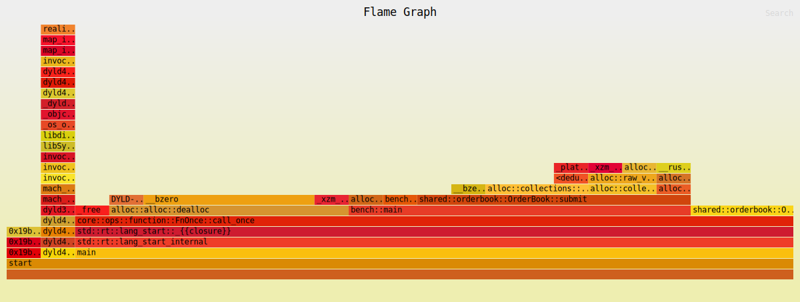

# Flamegraph 03 — VecDeque baseline (allocator dominated)

**Workload:** 500k aggressive orders sweeping 20 price levels with periodic replenishment.  
**Data structure:** `BTreeMap<Reverse<u64>, VecDeque<Order>>` per half-book.  
**Total samples:** 23

---

## Hot path

| Rank | Frame | Samples | % | Layer |
|------|-------|---------|---|-------|
| 1 | `shared::orderbook::OrderBook::submit` | 8 | 34.8% | matching logic |
| 2 | `alloc::alloc::dealloc` | 7 | 30.4% | allocator |
| 3 | `__bzero` | 5+1 | 26.1% | allocator (macOS secure-zero) |
| 4 | `BTreeMap::remove` | 3 | 13.0% | level cleanup |
| 5 | `VecDeque::grow` + `RawVec::grow_one` | 2+2 | 8.7% each | initial level allocation |
| 6 | `_platform_memmove` | 1 | 4.4% | VecDeque ring-buffer copy |

---

## Diagnosis

**Allocator dominates at 52%** (`dealloc` 30% + `__bzero` 26%).

Every time an aggressive sweep order fully consumes a price level:
1. `VecDeque` is dropped → `dealloc` frees its heap buffer
2. macOS secure-zeros the freed memory → `__bzero` (30% of total!)
3. Next replenishment creates a new level → fresh `malloc` + `VecDeque::grow_one`

This creates a malloc → free → bzero → malloc cycle on every level exhaustion. With 20 price levels and a high sweep rate, this cycle runs thousands of times per second.

`BTreeMap::remove` (13%) is the O(log n) tree rebalance triggered each time a level is pruned after draining. Unavoidable with BTreeMap but only called on level exhaustion.

`VecDeque::grow` (9%) is the initial capacity growth on first insert into a new level. Also avoidable if levels were pre-sized or reused.

**Root cause:** each VecDeque lives and dies with its price level. The allocator is recycling heap buffers that could simply be reused.

---

## What was tried next

→ **04.svg**: replaced `VecDeque` with `SmallVec<[Order; 4]>` to eliminate heap allocation for small queues. See [04.md](04.md).
