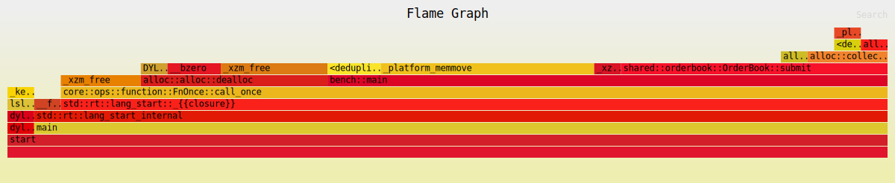

# Flamegraph 04 — SmallVec attempt (memmove regression)

**Workload:** same 500k aggressive sweep bench.  
**Data structure:** `BTreeMap<Reverse<u64>, SmallVec<[Order; 4]>>` — stack-allocated for ≤4 orders per level.  
**Total samples:** 33 (+43% vs 03 — this attempt made things **worse**)

---

## Hot path

| Rank | Frame | Samples | % | Layer |
|------|-------|---------|---|-------|
| 1 | `_platform_memmove` | 8+1 | 27.3% | SmallVec element shift |
| 2 | `alloc::alloc::dealloc` | 7 | 21.2% | allocator (unchanged) |
| 3 | `shared::orderbook::OrderBook::submit` | 10 | 30.3% | matching logic |
| 4 | `_xzm_free` | 3+4 | 21.2% | allocator internals |
| 5 | `__bzero` | 2 | 6.1% | allocator (reduced but present) |
| 6 | `BTreeMap::OccupiedEntry::remove_kv` | 3 | 9.1% | level cleanup |

---

## Diagnosis

**SmallVec swapped one bottleneck for another.**

`VecDeque` gives O(1) `pop_front` via its ring-buffer internal head pointer — no data is moved. `SmallVec` has no ring-buffer: `remove(0)` shifts all remaining elements left in memory. For the bench workload where replenishment adds 10 orders per level, each `remove(0)` moves 9 × sizeof(Order) = 9 × 24 bytes = 216 bytes via `memmove`.

This shows up immediately: `_platform_memmove` jumps from 4% (03.svg) to **27%**.

### Comparison vs 03

| Metric | 03 (VecDeque) | 04 (SmallVec) | Change |
|--------|--------------|---------------|--------|
| Total samples | 23 | **33** | +43% slower |
| `dealloc` + `__bzero` | 7+6 = 13 | 7+2 = 9 | −31% |
| `memmove` | 1 | **9** | +8× |
| `VecDeque::grow` | 4 | 0 | eliminated |
| Net | — | — | **regressed** |

The heap allocation cost fell (no more `VecDeque::grow`) but the element-shifting cost grew much faster. SmallVec is the right structure when queue depth stays ≤4 — in real trading, most price levels have 1–3 resting orders. The bench's artificial 10-order replenishment makes this the worst case.

**Root cause of regression:** `remove(0)` on SmallVec is O(n). For n>4 the SmallVec spills to heap anyway, then ALSO shifts elements. Double cost.

---

## What was tried next

→ **05.svg**: reverted to `VecDeque` (O(1) pop_front) and added a **free-list pool** to prevent the malloc/free cycle without touching element layout. See [05.md](05.md).
