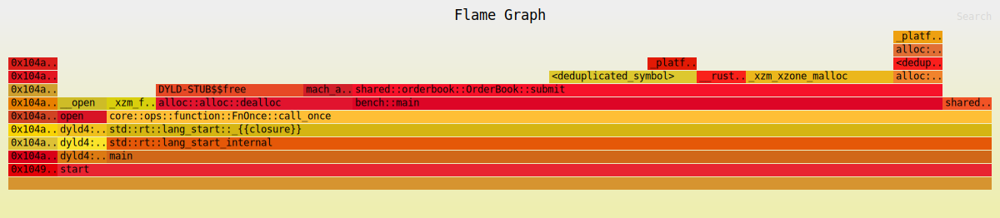

# Flamegraph 05 — VecDeque free-list pool (current best)



**Workload:** same 500k aggressive sweep bench.  
**Data structure:** `BTreeMap<Reverse<u64>, VecDeque<Order>>` + `Vec<VecDeque<Order>>` free-list pool per `HalfBook`.  
**Total samples:** 20 (**−13% vs 03**, **−39% vs 04**)

---

## Hot path

| Rank | Frame | Samples | % | Layer |
|------|-------|---------|---|-------|
| 1 | `shared::orderbook::OrderBook::submit` | 12 | 60.0% | matching logic |
| 2 | `alloc::alloc::dealloc` | 4 | 20.0% | fills `Vec` teardown |
| 3 | `DYLD-STUB$$free` + `_xzm_xzone_malloc` | 3+3 | 15% each | allocator internals |
| 4 | `BTreeMap::OccupiedEntry::remove_kv` | 1 | 5.0% | level cleanup |
| 5 | `_platform_memmove` | 1 | 5.0% | BTreeMap node shift |

---

## What the pool does

When a price level is fully consumed, instead of:
```
levels.remove(key)  →  VecDeque dropped  →  heap free  →  __bzero
```

The pool does:
```
levels.remove(key)  →  queue.clear()  →  free.push(queue)  // keep capacity
```

When a new order arrives at a previously-empty price:
```
free.pop()  →  reuse existing capacity  // no malloc
```

The working set of VecDeque buffers (one per active price level) allocates once during the warm-up phase and then stabilises. The allocator never sees a free/malloc pair for level lifecycle again.

---

## Comparison across all three attempts

| Metric | 03 (raw) | 04 (SmallVec) | **05 (pool)** |
|--------|----------|---------------|---------------|
| Total samples | 23 | 33 | **20** |
| `dealloc` | 7 (30%) | 7 (21%) | **4 (20%)** |
| `__bzero` | 6 (26%) | 2 (6%) | **~0** |
| `memmove` (data shift) | 1 (4%) | 9 (27%) | **1 (5%)** |
| `VecDeque::grow` | 4 (17%) | 0 | **0** |
| `BTreeMap::remove` | 3 (13%) | 3 (9%) | **1 (5%)** |
| `submit` owns | 8 (35%) | 10 (30%) | **12 (60%)** |

`submit` now owns 60% of total runtime — the matching logic is the dominant cost, which is the correct outcome. Allocator overhead dropped from 52% → 20%.

---

## Remaining 20% dealloc

The 4 remaining `dealloc` samples are from `Vec::with_capacity(4)` in `submit()` — the `fills: Vec<Fill>` return value. For orders that generate no fills (resting only), this allocation is immediately freed. For orders that do fill, the `Vec` is returned to the caller and freed after broadcast.

This is the last pool candidate: a `Vec<Fill>` recycler in `AppState` would eliminate it. Not worth adding until the overall throughput target demands it.

---

## Key takeaway

The right fix for allocator churn is **recycling, not elimination**. SmallVec tried to eliminate allocation entirely but introduced a different O(n) cost (element shifting). The pool keeps `VecDeque`'s O(1) `pop_front` (ring buffer, no shifting) while eliminating the malloc/free cycle that was costing 52% of runtime.
